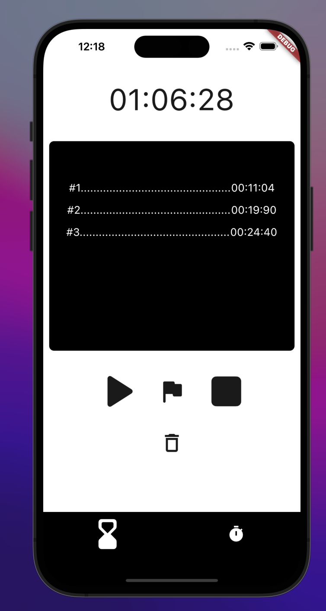
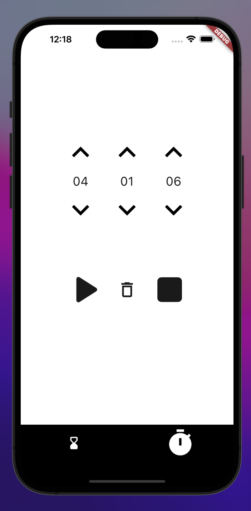
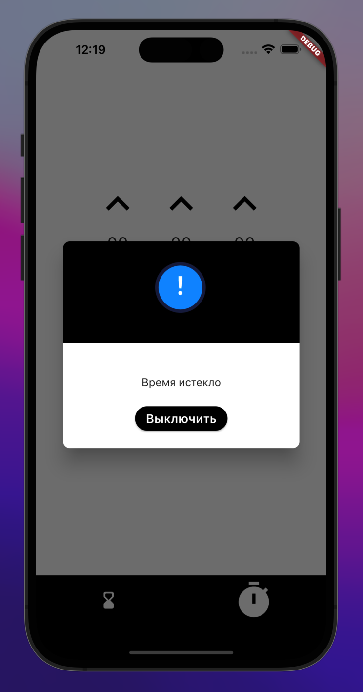

# timer_app
## Простое приложение которое и так есть у каждого на телефон
### Я сделал его чтобы 
* Укрепить свои знания в вёрстке и навигации
* научится алгоритмам и работе со временем

---
## Не весь функционал готов, ещё работаю над 
* Будильником
* Оповещениями
* Списком часовых поясов
